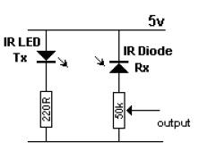

# smartmeters

Hier dokumentiere ich, wie ich meine Zählerstände auslese.
Aktuell lese ich einen Wärmemengenzähler für Fernwärme vom Type Landis Gyr T550 und einen Ferraris-Stromzähler aus.

## Heizung

Für den Wärmemengenzähler habe ich ein optisches Lesegerät mit USB-Anschluss bei Ebay gekauft. 
Name des Angebots war "USB IR Lesekopf EHZ Lese-Schreib-Kopf Volkszähler Hichi Smartmeter".

Den Code zum auslesen des Zählers habe ich im Internet gefunden: 

http://www.sedelmaier.at/node/112

Der Code hat für mich wunderbar funktioniert, ganz ohne Anpassungen.
Der Output ist etwas umfangreicher als nötig - das Ergebnis muss später noch geparsed werden.

Zusätzlich habe ich ein kleines Script geschrieben, dass über crontab einmal die Stunde ausgeführt wird.
Es triggert das auslesen des Zählers und parsed das Ergebnis. 
Dann schreibt es die aktuelle Zeit, formatiert als epoch, und den Zählerstand, in ein csv file.
Ich verbinde mich regelmäßig über ssh mit dem pi und hole den Inhalt der csv-Datei ab.
Diesen importiere ich in ein google sheet.

## Strom

Das Auslesen eines Ferraris-Stromzählers erfordert etwas Bastelarbeit mit dem Lötkolben.
Das Konzept ist einfach: eine Infrarot-LED leuchtet das Rad des Zählers an, ein Infrarotempfänger misst das reflektierte Licht.
Wenn die rote Stelle vorne ist, dann zeigt der Empfänger eine Veränderung im Signal.

Der Schaltplan sieht ungefähr so aus (ich habe das Bild im Internet gefunden - ich weiß nicht mehr, welche Widerstände ich verbaut habe...):

Da der IR-Widerstand ein Analogsignal abgibt messe ich es mit einem Arduino nano.
Der Code im Arduino schaltet die IR LED ein, nimmt den Wert vom Sensor und schaltet die LED wieder aus.
Wenn der Wert unter einem (exprimentell bestimmten) Schwellwert liegt, dann wird ein Pin auf HIGH gesetzt.
Ansonsten wird der Pin auf Low gezogen.

Danach kommt ein Raspberry PI an die Reihe, mit dem der Pin des Arduino ausgelesen wird.
Leider läuft das Arduino mit 5V, das Raspberry Pi verträgt nur ein Logiklevel von 3,3V. 
Deshalb steckt dazwischen noch ein level-shifter.

Mittels einem python-script wird ein Interrupt auf die steigende Flanke am input-Pin gelegt.
Der Interrupt-Handler erhöht dann einen Zähler und schreibt den in eine Datei.
Diese Datei wird, wie schon beim Wärmemengenzähler, über crontab regelmäßig ausgelesen und in eine csv-Datei geschrieben.

## InfluxDB

Ich experimentiere gerade damit, die Messwerte in eine InfluxDB zu schreiben. 
Ich habe entsprechende python-scripte zu den Verzeichnissen hinzugefügt.
InfluxDB kann z.B. als Cloud-SaaS-Angebot über AWS gebucht werden.